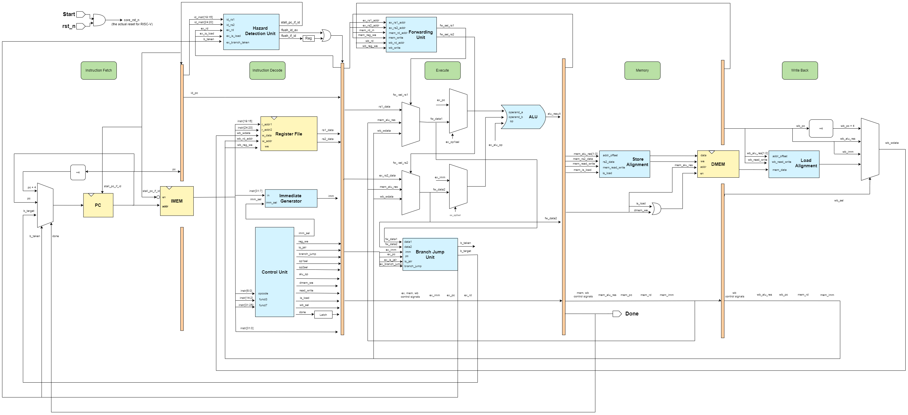
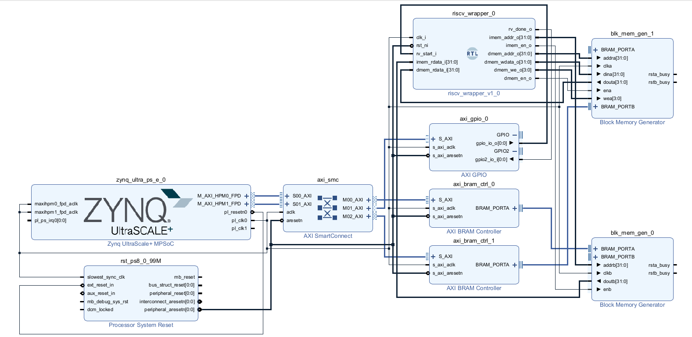

# RV32I RISC-V Processor Design

A complete implementation of the **RV32I base integer instruction set architecture (ISA)**. This repository showcases the architectural evolution from a foundational single-cycle processor to a high-performance, 5-stage pipelined design, verified through comprehensive simulation and physical implementation metrics.

---

## Architecture Overview

The project follows a modular design, separating the datapath components (ALU, Register File, Control Unit) to facilitate scalability and ease of verification.




---

## Core Features

* **RV32I Compliance**: Full support for the base integer instruction set.
* **Dual Architecture Models**: 
    * `cpu_single_cycle`: Foundational design for core logic validation.
    * `Pipeline_RISCV`: Optimized 5-stage pipeline (IF, ID, EX, MEM, WB) for high-throughput execution.
* **Hazard Management**: Implements a robust **Forwarding Unit** and **Stall logic** to resolve Data and Control hazards.
* **Verification Suite**: Comprehensive assembly and machine-code test suite for ISA compliance.

---

## Built With

* **Hardware Description Language**: Verilog (IEEE 1364-2005)
* **EDA Tool**: Xilinx Vivado 2025.1
* **Verification**: Custom assembly testbench suites
* **Target Architecture**: RISC-V RV32I

## Repository Structure

* `/cpu_single_cycle`: Single-cycle implementation logic.
* `/Pipeline_RISCV`: Pipelined processor implementation with hazard detection.
* `/Embedded_C_Code`: Software stacks and C firmware for testing.
* `/hex_tests`: Compiled machine code vectors for memory initialization.
* `/images`: Documentation assets and design diagrams.
* `/rtl`: Core reusable hardware modules.
* `/scripts`: Tcl scripts for automated project generation.
* `/tb`: RTL behavioral simulation testbenches.

---

## Installation & Usage

**1. Clone the repository:**
```bash
git clone [https://github.com/YourUsername/YourRepoName.git](https://github.com/YourUsername/YourRepoName.git)
cd YourRepoName

```

**2. Rebuild the Vivado Project:**
To automatically restore the project (including all IP and block design configurations):

```bash
vivado -mode batch -source scripts/build_project.tcl

```

**3. Verification:**
Load the `.hex` files from `/hex_tests` into the instruction memory in your simulation environment to execute sample programs.

---

## Implementation Results

The following metrics summarize the physical design performance after implementation on the target FPGA.

| Metric | Visualization |
| --- | --- |
| **Timing Closure** |  |
| **Resource Utilization** |  |
| **Device Floorplan** |  |
| **Power Profile** |  |

---

## Expected Output

Verification logs demonstrate correct instruction execution against the CPU golden model.

---

## Contributing

Contributions are greatly appreciated. Please fork the repo, create a feature branch, and open a Pull Request.

## License

Distributed under the MIT License. See `LICENSE` file for more information.

```


Chúc bạn bảo vệ đồ án thành công!

```
